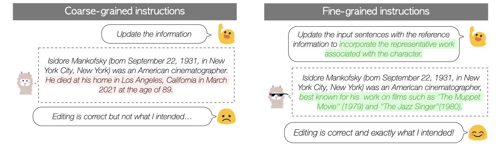

# XATU: A Fine-grained Instruction-based Benchmark for Explainable Text Updates

[](https://arxiv.org/abs/2309.11063/)

This repository contains the dataset reproduction scripts for XATU: A Fine-grained Instruction-based Benchmark for Explainable Text Updates.
Data and codes will be available upon acceptance.




## Citations
```bibtex
@misc{zhang2023xatu,
      title={XATU: A Fine-grained Instruction-based Benchmark for Explainable Text Updates}, 
      author={Haopeng Zhang and Hayate Iso and Sairam Gurajada and Nikita Bhutani},
      year={2023},
      eprint={2309.11063},
      archivePrefix={arXiv},
      primaryClass={cs.CL}
}
```

